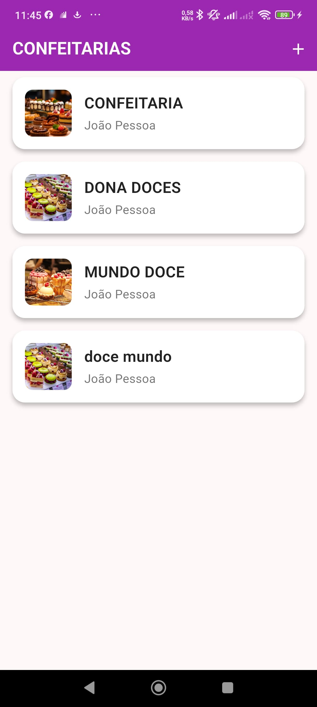
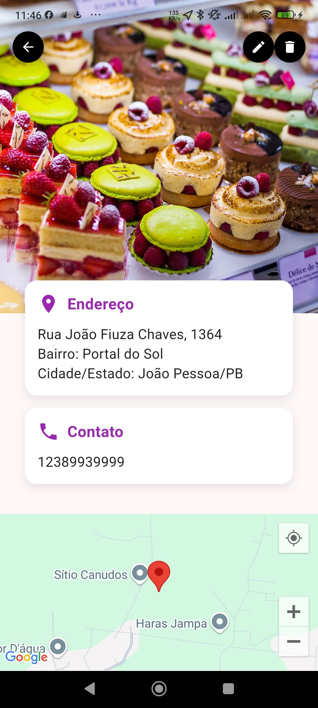

# 🍰 Confeitaria Marketplace

Um aplicativo Flutter para gerenciamento de confeitarias e seus produtos, integrando geolocalização e funcionalidades administrativas.

---

## 📱 Funcionalidades

- Cadastro e edição de Confeitarias
- Cadastro e edição de Produtos (nome, descrição, valor, imagens)
- Exclusão de Confeitarias e Produtos
- Listagem de Confeitarias e seus Produtos
- Integração com Google Maps (localização de Confeitarias)
- Interface moderna e responsiva
- Gerenciamento de estado usando **Flutter BLoC**
- Armazenamento de imagens locais ou URLs externas
- Separacao de camadas (Pages, Bloc, Repository, Models)

---

## 🛠️ Tecnologias Utilizadas

- **Flutter** (SDK)
- **Flutter BLoC** (Gerenciamento de estado)
- **Flutter Dotenv** (Carregar variáveis de ambiente)
- **Google Maps** (Localização de confeitarias)
- **SQLite** (Persistência local usando DAO)
- **Material 3** (Design moderno)

---

## 🚀 Como Rodar o Projeto

### Pré-requisitos

- Flutter 3.10 ou superior
- Android Studio ou VSCode
- Dispositivo ou emulador configurado

### Passos:

1. **Clone o repositório**
```bash
git clone https://github.com/seu-usuario/confeitaria_marketplace.git
cd confeitaria_marketplace
```

2. **Instale as dependências**
```bash
flutter pub get
```

3. **Crie o arquivo `.env` na raiz do projeto**
```bash
touch .env
```

E adicione sua chave do Google Maps:

```
GOOGLE_MAPS_API_KEY=sua_chave_aqui
```

4. **Execute o projeto**
```bash
flutter run
```

---

## 📂 Estrutura de Pastas

```bash
lib/
├── features/
│   ├── confeitarias/
│   └── produtos/
├── shared/
│   ├── database/
│   └── widgets/
└── main.dart
```

---

## ⚙️ Configuração do Google Maps

- No Android (`android/app/src/main/AndroidManifest.xml`), adicione:

```xml
<meta-data
  android:name="com.google.android.geo.API_KEY"
  android:value="${GOOGLE_MAPS_API_KEY}"/>
```

- Certifique-se que o `.env` foi corretamente carregado no `main.dart`:

```dart
await dotenv.load(fileName: ".env");
```
---

## ✨ Telas Principais

- Listagem de Confeitarias
- Detalhes da Confeitaria com a localizaçao da confeitaria 
- lista de produtos
- Cadastro/Edição de Confeitaria
- Cadastro/Edição de Produto
- Mapa com localização das confeitarias (futuro)

---

## Capturas de Tela

### Tela Inicial


### Detalhes do Produto


### Tela de Cadastro


---

## 💻 Desenvolvido por

**Davison Tavares**  
[LinkedIn](https://www.linkedin.com/in/davison-tavares/) | [GitHub](https://github.com/DavisonTavares)

---

> Projeto desenvolvido como desafio Flutter para a **Engeselt** 🚀

